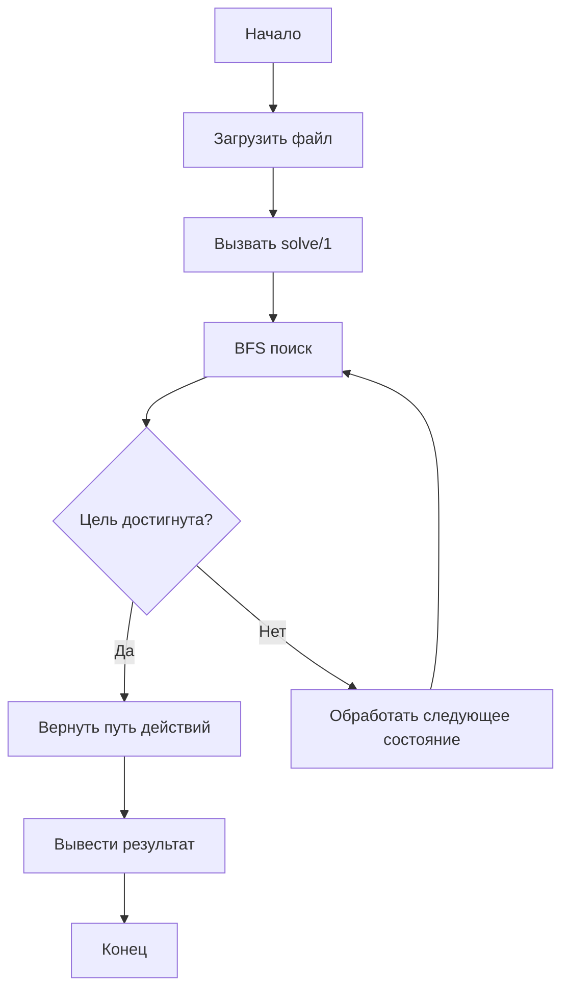
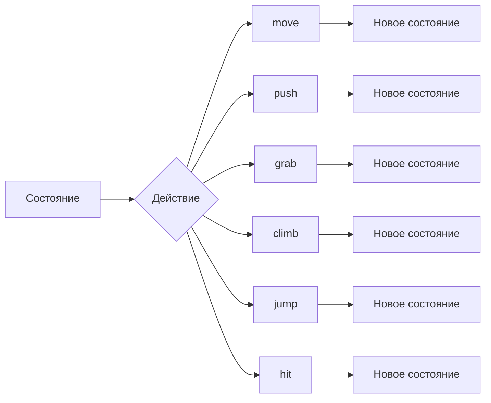
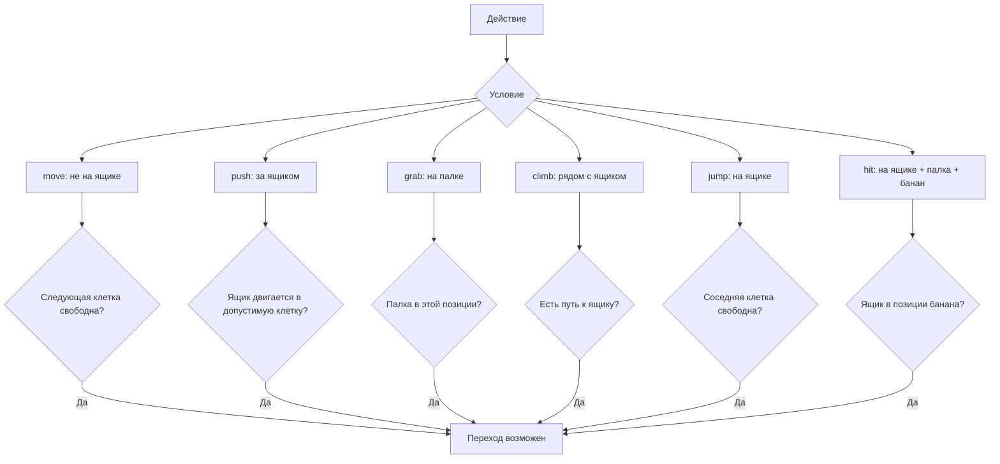

# Задача "Обезьяна и банан" — Документация

## 1. Описание структур данных

### Структура состояния мира

```prolog
state(Обезьяна, Ящик, ПалкаВРуке, НаЯщике, БананДобыт)
```

| Поле | Тип | Описание |
|------|------|---------|
| Обезьяна | `[X, Y]` | Координаты обезьяны |
| Ящик | `[X, Y]` | Координаты ящика |
| ПалкаВРуке | `yes/no` | Взяла ли обезьяна палку |
| НаЯщике | `yes/no` | На ящике ли обезьяна |
| БананДобыт | `yes/no` | Добыт ли банан |

### Начальное состояние

```prolog
init(state([1, 1], [2, 2], no, no, no))
% Обезьяна: [1,1]
% Ящик:     [2,2]
% Палка:    не взята
% На ящике: нет
% Банан:    не добыт
```

### Целевое состояние

```prolog
goal(state(_, _, yes, _, yes))
% Палка в руке = yes
% Банан добыт = yes
```

### Препятствия (лужи)

Препятствия можно добавить через предикат `obstacle([X, Y])`:
```prolog
:- assertz(obstacle([3, 2])).  % Лужа
:- assertz(obstacle([3, 3])).
```

---

## 2. Блок-схемы алгоритмов

### 2.1. Общая структура решения



### 2.2. Алгоритм BFS

```mermaid
flowchart TD
    A[Начало BFS] --> B["Очередь = [[Start, []]]"]
    B --> C{Очередь пуста?}
    C -->|Да| D[Решения нет]
    C -->|Нет| E["State, Path = голова очереди"]
    E --> F{goal(State)?}
    F -->|Да| G["Вернуть Path"]
    F -->|Нет| H["Findall: все переходы из State"]
    H --> I{Новое состояние уже было?}
    I -->|Да| J[Пропустить]
    J --> K["Добавить в хвост очереди"]
    I -->|Нет| K
    K --> L["Visited = [State | Visited]"]
    L --> C
```

### 2.3. Переходы между состояниями



### 2.4. Проверка предусловий действий



---

## 3. Примеры запуска и вывода

### Пример 1: Запуск по умолчанию

```bash
swipl monkey.pl -g "go, halt."
```

**Вывод:**
```
========================================
  ЗАДАЧА: ОБЕЗЬЯНА И БАНАН
========================================

Начальная позиция: обезьяна [1,1], ящик [2,2]
Цель: взять палку [4,1], достать банан [3,4]

РЕШЕНИЕ НАЙДЕНО:
  move(up,[1,2])
  climb
  jump(right,[3,2])
  push(right,[3,2],[4,2])
  move(down,[4,1])
  grab
  move(up,[4,2])
  move(up,[4,3])
  move(left,[3,3])
  push(up,[3,3],[3,4])
  push(up,[3,4],[3,5])
  climb
  hit

БАКУ! Банан добыт!
```

### Пример 2: Интерактивный режим

```bash
swipl monkey.pl
```

```
?- solve(Actions).
Actions = [move(up, [1, 2]), climb, jump(right, [3, 2]), ...].

?- print_actions(Actions).
  move(up,[1,2])
  climb
  ...
```

### Пример 3: Тест переходов

```bash
echo "init(S), trans(S, A, N), writeq([A, N])." | swipl monkey.pl
```

**Вывод:**
```
[move(up,[1,2]), state([1,2],[2,2],no,no,no)]
[move(right,[2,1]), state([2,1],[2,2],no,no,no)]
```

---

## 4. Инструкция по запуску

### 4.1. В терминале

```bash
# Перейти в каталог с файлом
cd /путь/к/каталогу

# Запуск с выводом
swipl monkey.pl -g "go, halt."

# Или интерактивный режим
swipl monkey.pl
```

### 4.2. В VS Code

1. Установить расширение **Prolog** (или аналогичное)
2. Открыть файл `monkey.pl`
3. Нажать `F5` или выбрать "Run Prolog"
4. Или в терминале: `swipl monkey.pl`

### 4.3. Проверка синтаксиса

```bash
swipl -g "consult(monkey), halt." monkey.pl
```

---

## 5. Шпаргалка для защиты

### 5.1. Как работает поиск?

**BFS (поиск в ширину)** — мы ищем решение по уровням:
1. Сначала проверяем все состояния на расстоянии 1 от начала
2. Потом на расстоянии 2, и т.д.
3. Первое найденное состояние-цель даёт кратчайший путь

**Структура очереди:** `[[Состояние, ПутьКНему], ...]`

### 5.2. Как избегаются петли?

Используется список `Visited` — множество уже обработанных состояний.
- Перед добавлением нового состояния проверяем: `\+ member_state(Next, Visited)`
- `member_state` использует `==` (проверка тождественности), чтобы избежать ложных совпадений при унификации

### 5.3. Почему выбрана структура `state/5`?

- **Минимальность**: только необходимые поля
- **Уникальность**: каждое состояние однозначно определяется пятью значениями
- **Простота проверки**: целевое состояние проверяется одним термом `goal(state(_, _, yes, _, yes))`

### 5.4. Как проверяются препятствия?

Предикат `valid([X, Y])`:
```prolog
valid([X, Y]) :- size(S), X >= 1, X =< S, Y >= 1, Y =< S.
```
Проверяет границы клетки. Лужи можно добавить:
```prolog
valid([X, Y]) :- \+ obstacle([X, Y]).
```

### 5.5. Почему BFS, а не DFS?

- **BFS** находит кратчайший путь (минимальное число действий)
- **DFS** может зациклиться на больших пространствах
- BFS с `visited` гарантирует завершение

### 5.6. Какие действия возможны?

| Действие | Предусловие | Эффект |
|----------|-------------|--------|
| `move` | Не на ящике, целевая клетка свободна | Обезьяна двигается |
| `push` | Обезьяна за ящиком | Ящик и обезьяна двигаются |
| `grab` | Обезьяна на палке | Палка взята |
| `climb` | Рядом с ящиком | Обезьяна на ящике |
| `jump` | На ящике | Спуск с ящика |
| `hit` | На ящике + палка + банан сверху | Банан добыт |

### 5.7. Что делать, если решение не находится?

1. Проверить `init/1` — правильные ли начальные координаты
2. Проверить `goal/1` — правильное ли условие цели
3. Проверить `banana_pos/1` и `stick_pos/1` — достижимы ли
4. Убедиться, что есть путь: обезьяна может дойти до палки, до ящика, до банана

---

## 6. Тестовые запросы

### Тест 1: Проверка переходов

```prolog
?- init(S), trans(S, A, N).
% Должно показать возможные действия из начального состояния
```

### Тест 2: Проверка цели

```prolog
?- goal(state([3,4],[3,4],yes,yes,yes)).
% true.
```

### Тест 3: Поиск решения

```prolog
?- solve(Actions), print_actions(Actions).
% Показывает кратчайший путь к цели
```

### Тест 4: Смена начальной позиции

```prolog
?- retract(init(_)), assertz(init(state([5,5],[1,1],no,no,no))), solve(A).
```

---

## 7. Ограничения и расширения

### Ограничения
- Фиксированный размер клетки (5x5)
- Один ящик, одна палка, один банан
- Нет поддержки нескольких агентов

### Возможные расширения
1. **Динамические препятствия**: добавить `obstacle/1`
2. **Переменный размер клетки**: параметризовать `size/1`
3. **Визуализация**: добавить вывод ASCII-арта
4. **Эвристики**: перейти к A* для оптимизации
